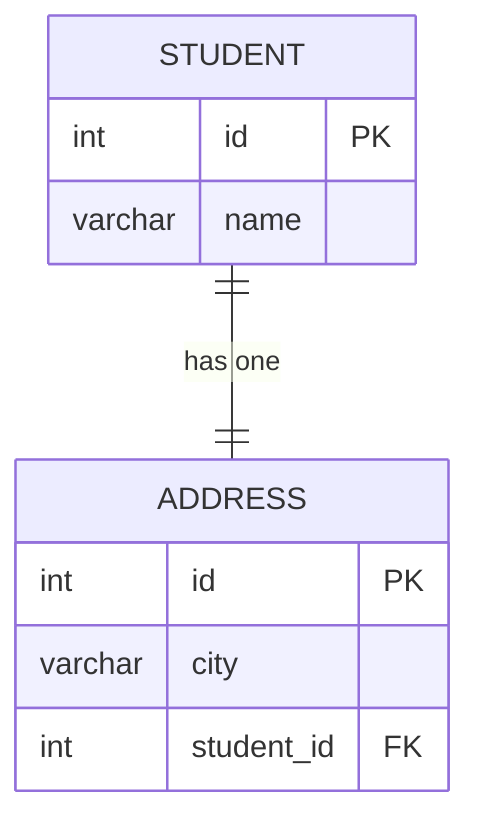
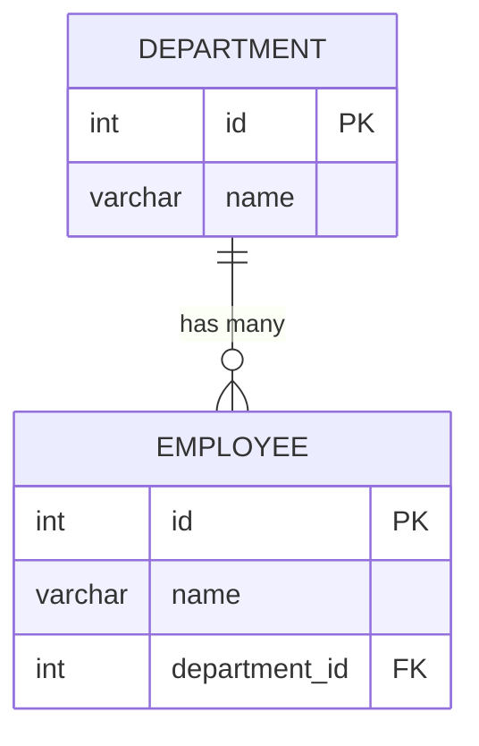
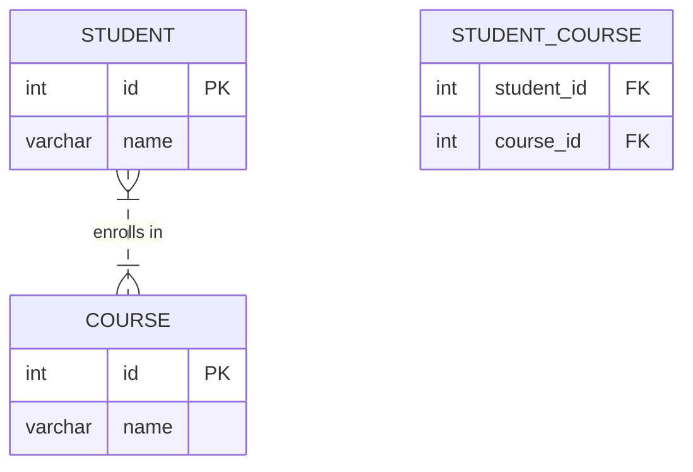

Here's a clear, structured, and practical guide to help you understand how to connect tables in **One-to-One**, **One-to-Many**, and **Many-to-Many** relationships using:

- ✅ ER Diagram
- ✅ SQL Queries
- ✅ Spring Data JPA Entity Classes

Let's explore each clearly and step-by-step:

---

# 🟢 **1. One-to-One Relationship**

### ✅ **ER Diagram**



---

### ✅ **SQL Queries**

```sql
CREATE TABLE student (
    id INT PRIMARY KEY AUTO_INCREMENT,
    name VARCHAR(100)
);

CREATE TABLE address (
    id INT PRIMARY KEY AUTO_INCREMENT,
    city VARCHAR(100),
    student_id INT UNIQUE, -- Unique ensures one-to-one relationship
    FOREIGN KEY (student_id) REFERENCES student(id)
);
```

---

### ✅ **Spring Data JPA Entities**

**`Student.java`**
```java
@Entity
public class Student {

    @Id @GeneratedValue
    private Integer id;
    private String name;

    @OneToOne(mappedBy = "student", cascade = CascadeType.ALL)
    private Address address;

    // getters, setters
}
```

**`Address.java`**
```java
@Entity
public class Address {

    @Id @GeneratedValue
    private Integer id;
    private String city;

    @OneToOne
    @JoinColumn(name = "student_id")
    private Student student;

    // getters, setters
}
```

---

# 🟢 **2. One-to-Many Relationship**

(**Example**: One Department has Many Employees)

### ✅ **ER Diagram**



---

### ✅ **SQL Queries**

```sql
CREATE TABLE department (
    id INT PRIMARY KEY AUTO_INCREMENT,
    name VARCHAR(100)
);

CREATE TABLE employee (
    id INT PRIMARY KEY AUTO_INCREMENT,
    name VARCHAR(100),
    department_id INT,
    FOREIGN KEY (department_id) REFERENCES department(id)
);
```

---

### ✅ **Spring Data JPA Entities**

**`Department.java`**
```java
@Entity
public class Department {

    @Id @GeneratedValue
    private Integer id;
    private String name;

    @OneToMany(mappedBy = "department", cascade = CascadeType.ALL)
    private List<Employee> employees = new ArrayList<>();

    // getters, setters
}
```

**`Employee.java`**
```java
@Entity
public class Employee {

    @Id @GeneratedValue
    private Integer id;
    private String name;

    @ManyToOne
    @JoinColumn(name = "department_id")
    private Department department;

    // getters, setters
}
```

---

# 🟢 **3. Many-to-Many Relationship**

(**Example:** Many Students can take Many Courses)

### ✅ **ER Diagram**



---

### ✅ **SQL Queries**

```sql
CREATE TABLE student (
    id INT PRIMARY KEY AUTO_INCREMENT,
    name VARCHAR(100)
);

CREATE TABLE course (
    id INT PRIMARY KEY AUTO_INCREMENT,
    name VARCHAR(100)
);

CREATE TABLE student_course (
    student_id INT,
    course_id INT,
    PRIMARY KEY (student_id, course_id),
    FOREIGN KEY (student_id) REFERENCES student(id),
    FOREIGN KEY (course_id) REFERENCES course(id)
);
```

---

### ✅ **Spring Data JPA Entities**

**`Student.java`**
```java
@Entity
public class Student {

    @Id @GeneratedValue
    private Integer id;
    private String name;

    @ManyToMany(cascade = CascadeType.ALL)
    @JoinTable(name = "student_course",
        joinColumns = @JoinColumn(name = "student_id"),
        inverseJoinColumns = @JoinColumn(name = "course_id"))
    private Set<Course> courses = new HashSet<>();

    // getters, setters
}
```

**`Course.java`**
```java
@Entity
public class Course {

    @Id @GeneratedValue
    private Integer id;
    private String name;

    @ManyToMany(mappedBy = "courses")
    private Set<Student> students = new HashSet<>();

    // getters, setters
}
```

---

# 🚩 **Quick summary of differences clearly explained:**

| Relationship Type | Explanation                                   | Example                             | ER Cardinality  |
|-------------------|-----------------------------------------------|-------------------------------------|-----------------|
| **One-to-One**    | Single record from Table A matches exactly one record from Table B | Person ↔ Passport | `||--||`        |
| **One-to-Many**   | Single record from Table A relates to multiple records in Table B | Department ↔ Employees | `||--o{`        |
| **Many-to-Many**  | Records from Table A relate to many records in Table B and vice-versa | Students ↔ Courses | `}|..|{`        |

---

# 🎯 **Best Practices:**

- Clearly define **ownership** (`mappedBy`) in bidirectional relationships.
- Always consider using **cascade operations** to simplify database operations.
- For large data, use **lazy loading** (`FetchType.LAZY`) to improve performance.

---

# 🚀 **Example usage in Spring Data JPA (Saving entities clearly):**

**One-to-One Saving:**
```java
Student student = new Student();
student.setName("Alice");

Address address = new Address();
address.setCity("Bengaluru");
address.setStudent(student);

student.setAddress(address);

studentRepository.save(student);
```

**One-to-Many Saving:**
```java
Department department = new Department();
department.setName("HR");

Employee e1 = new Employee();
e1.setName("John");
e1.setDepartment(department);

Employee e2 = new Employee();
e2.setName("Emma");
e2.setDepartment(department);

department.getEmployees().add(e1);
department.getEmployees().add(e2);

departmentRepository.save(department);
```

**Many-to-Many Saving:**
```java
Student student = new Student();
student.setName("Bob");

Course course1 = new Course();
course1.setName("Java");

Course course2 = new Course();
course2.setName("Python");

student.getCourses().add(course1);
student.getCourses().add(course2);

studentRepository.save(student);
```

---

## 🗃️ **Final Thoughts:**

By following this structured example, you've learned clearly:

- ✅ Designing relationships through ER diagrams.
- ✅ Implementing them in SQL.
- ✅ Mapping clearly defined relationships with Spring Data JPA.

This will greatly simplify your future database and JPA development tasks.
