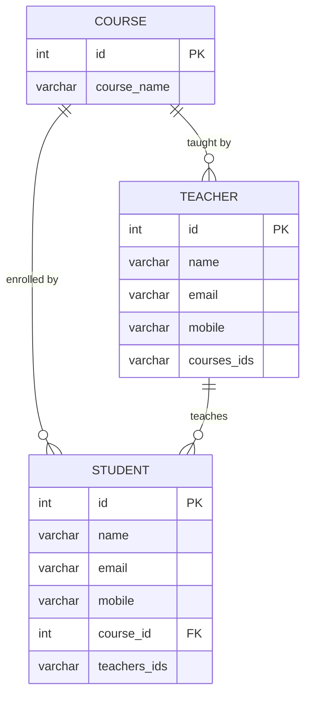
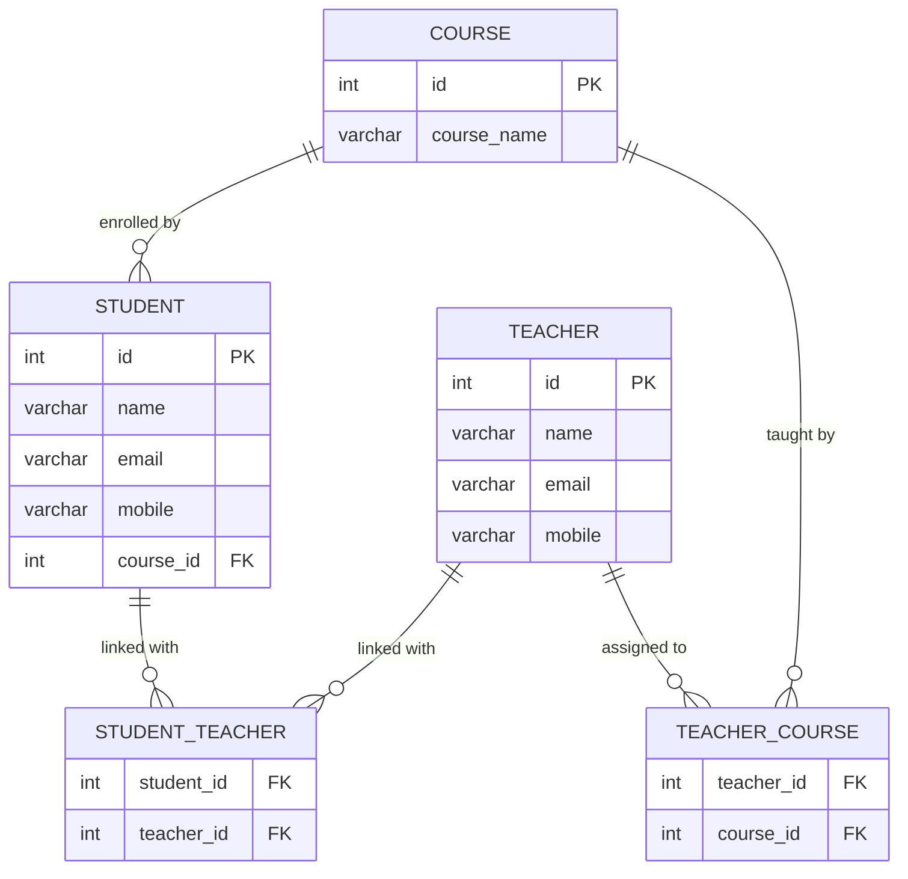

## 🔷 **Step 1: Initial ER Diagram (as per your requirement):**



**Issue in this design:**
- The fields `teachers_ids` and `courses_ids` contain comma-separated multiple IDs, which violates First Normal Form (1NF).

---

## ✅ **Step 2: Normalization Process**

### **1NF (First Normal Form)**  
- Each field must contain only atomic (single) values.
- No repeating groups or arrays.

To fix:
- Remove `teachers_ids` and `courses_ids` from original tables.
- Introduce relationship (junction) tables to handle many-to-many relationships.

### **2NF (Second Normal Form)**  
- Achieve 1NF first.
- Remove partial dependencies (a non-key field should not depend partially on a composite key).

Already satisfied after applying junction tables clearly.

### **3NF (Third Normal Form)**  
- Achieve 2NF first.
- Remove transitive dependencies (non-key field depending on another non-key field).

Already satisfied as there are no transitive dependencies after junction tables introduced.

---

## 🎯 **Normalized Tables:**

Now after normalization, the tables look like this:

- **STUDENT**
```
id (PK)
name
email
mobile
course_id (FK to COURSE)
```

- **TEACHER**
```
id (PK)
name
email
mobile
```

- **COURSE**
```
id (PK)
course_name
```

- **STUDENT_TEACHER** *(Junction table for Many-to-Many Relationship)*
```
student_id (FK to STUDENT)
teacher_id (FK to TEACHER)
```

- **TEACHER_COURSE** *(Junction table for Many-to-Many Relationship)*
```
teacher_id (FK to TEACHER)
course_id (FK to COURSE)
```

---

## 🔷 **Step 3: Normalized ER Diagram (Final):**



---

## 🎓 **Differences and Benefits after Normalization:**

| Before Normalization | After Normalization |
|----------------------|---------------------|
| Fields have multiple IDs (comma-separated). | All fields have atomic values (single entries). |
| Difficult to query and update relations. | Easier, efficient queries using joins and relational integrity. |
| Poor database efficiency and redundancy. | Improved database performance, less redundancy, more clarity. |
| Violates database design principles (1NF). | Follows database principles (1NF, 2NF, 3NF). |

---

## 🚩 **How to Normalize: Quick Summary**

- Identify repeating groups or multi-valued attributes → create separate tables.
- Define clear primary keys and foreign keys relationships.
- Ensure each table’s columns depend only on the primary key.
- Validate against 1NF, 2NF, and 3NF principles to confirm normalized design.

---

This structured guide gives a clear understanding of creating an ER diagram initially, then performing normalization, and finally arriving at a proper normalized design with clear relationships.
